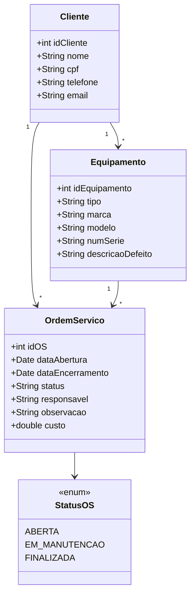
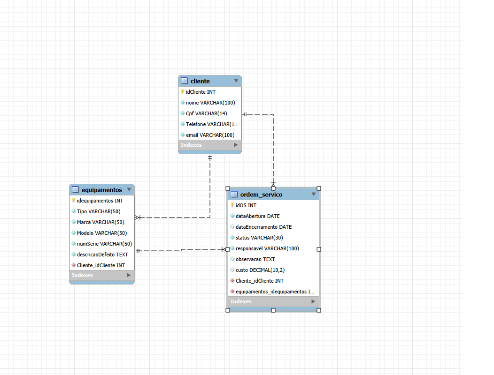

# 🔧 Senac Solutions

### Sistema de Gestão de Ordens de Serviço


---

# 📖 Sobre o Projeto

O **Senac Solutions** é um sistema desenvolvido em Java para gerenciamento de clientes, equipamentos e ordens de serviço de uma assistência técnica.

O projeto tem como objetivo automatizar o controle dos atendimentos técnicos, permitindo o cadastro de clientes, gerenciamento de equipamentos, abertura e acompanhamento de ordens de serviço e emissão de relatórios gerenciais.

Desenvolvido como parte do **Projeto Integrador do programa Jovem Programador da Faculdade Senac Blumenau**, o sistema aplica conceitos de Programação Orientada a Objetos, persistência de dados com JDBC e banco de dados MySQL.

---

# 🎯 Objetivos do Sistema

O sistema permite:

* Gerenciar clientes
* Controlar equipamentos recebidos para manutenção
* Abrir ordens de serviço
* Atualizar o andamento dos atendimentos
* Encerrar serviços concluídos
* Emitir relatórios gerenciais
* Registrar histórico das manutenções realizadas

---

# 🛠 Tecnologias Utilizadas

* Java
* Programação Orientada a Objetos (POO)
* JDBC
* MySQL
* Git
* GitHub
* Visual Studio Code

---

# 📊 Diagrama de Classes (UML)



---

# 🗄 Modelo Entidade-Relacionamento (Banco de Dados)

> Exportar o diagrama criado no MySQL Workbench para a pasta `docs` do projeto.

```text
docs/
└── mer-senac-solutions.png
```

Após exportar a imagem:

```md

```

### Relacionamentos

* Cliente (1) → (N) Equipamentos
* Cliente (1) → (N) Ordens de Serviço
* Equipamento (1) → (N) Ordens de Serviço

---

# 📂 Estrutura do Projeto

```text
src/

├── br.com.senac.dao
│   ├── ClienteDAO.java
│   ├── EquipamentoDAO.java
│   └── OrdemServicoDAO.java
│
├── br.com.senac.jdbc
│   └── ConexaoJDBC.java
│
├── br.com.senac.model
│   ├── Cliente.java
│   ├── Equipamento.java
│   ├── OrdemServico.java
│   └── StatusOS.java
│
└── br.com.senac.view
    └── Main.java
```

---

# 🚀 Funcionalidades Implementadas

## 👤 Gestão de Clientes

* Cadastro de clientes
* Consulta de clientes
* Atualização de clientes
* Exclusão de clientes

## 💻 Gestão de Equipamentos

* Cadastro de equipamentos
* Consulta de equipamentos
* Atualização de equipamentos
* Exclusão de equipamentos
* Associação de equipamento ao cliente

## 📋 Gestão de Ordens de Serviço

* Abertura de OS
* Consulta de OS
* Atualização de status
* Encerramento de OS
* Histórico de atendimentos

## 📈 Relatórios Gerenciais

* Clientes cadastrados
* Ordens em andamento
* Ordens finalizadas
* Histórico completo de OS

---

# 🗄 Banco de Dados

## Tabela Cliente

| Campo     | Tipo         |
| --------- | ------------ |
| idCliente | INT          |
| nome      | VARCHAR(100) |
| cpf       | VARCHAR(14)  |
| telefone  | VARCHAR(15)  |
| email     | VARCHAR(100) |

---

## Tabela Equipamentos

| Campo             | Tipo        |
| ----------------- | ----------- |
| idequipamentos    | INT         |
| tipo              | VARCHAR(50) |
| marca             | VARCHAR(50) |
| modelo            | VARCHAR(50) |
| numSerie          | VARCHAR(50) |
| descricaoDefeito  | TEXT        |
| Cliente_idCliente | INT         |

---

## Tabela Ordem_Servico

| Campo                       | Tipo          |
| --------------------------- | ------------- |
| idOS                        | INT           |
| dataAbertura                | DATE          |
| dataEncerramento            | DATE          |
| status                      | VARCHAR(30)   |
| responsavel                 | VARCHAR(100)  |
| observacao                  | TEXT          |
| custo                       | DECIMAL(10,2) |
| Cliente_idCliente           | INT           |
| equipamentos_idequipamentos | INT           |

---

# ⚙️ Como Executar o Projeto

## 1️⃣ Clonar o Repositório

```bash
git clone https://github.com/samuelclaudino1994-crypto/Projeto-integrador-
```

## 2️⃣ Criar o Banco de Dados

Execute o script SQL disponível no projeto.

## 3️⃣ Configurar a Conexão

Arquivo:

```java
ConexaoJDBC.java
```

Configure:

* URL do banco
* Usuário
* Senha

## 4️⃣ Executar o Projeto

Execute a classe:

```java
Main.java
```

---

# 📌 Regras de Negócio

* Toda Ordem de Serviço deve estar vinculada a um cliente.
* Todo equipamento deve pertencer a um cliente.
* Uma OS só pode ser aberta para equipamentos cadastrados.
* Uma OS finalizada não pode ser encerrada novamente.
* O sistema registra data de abertura e data de encerramento.

---

# 🔮 Melhorias Futuras

* Interface gráfica utilizando JavaFX
* Dashboard gerencial
* Exportação de relatórios PDF
* Validação de CPF
* Validação de e-mail
* Controle de usuários
* Sistema de autenticação
* Controle de permissões

---

# 👨‍💻 Autor

**Samuel de Moura Claudino**

Projeto Integrador – Jovem Programador

Faculdade Senac Blumenau

---

⭐ Caso tenha gostado do projeto, deixe uma estrela no repositório.
